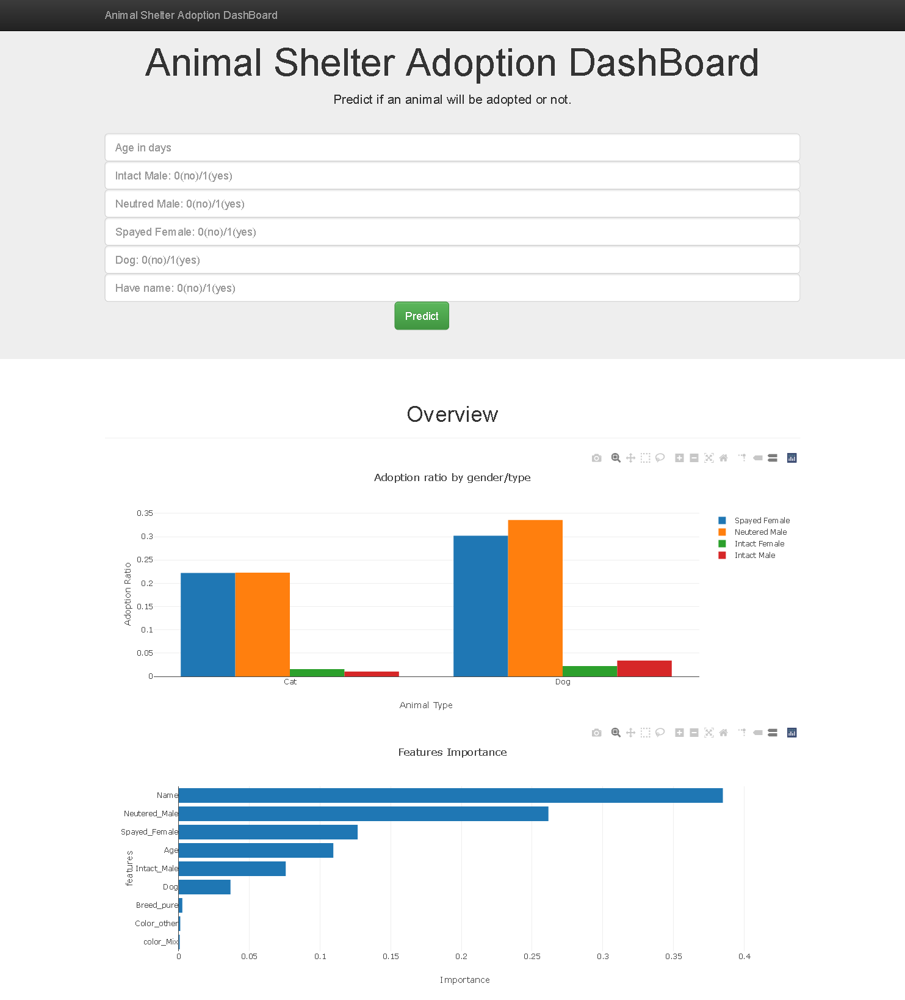

# Luxury Used Cars Price Prediction 
## Abstract
A non-profit organization is sponsoring an animal shelter that is struggling with the decline of the adoption rate. Studying the features that make animals more likely to get adopted and paying attention to features that make animals stay longer in the shelter and find solutions to help them find a new home.

## Design
The dataset contains around 26k with 10 features, all of which are categorical. A few feature highlights include Name, Age, Breed, and Color. Some of the features were dropped and other grouped into more general categories, and an in-depth analysis of the rest of them was undertaken to inform baseline models and feature engineering.

## Data
The data was collected from [kaggle](https://www.kaggle.com/c/shelter-animal-outcomes) . The focus was targeted on finding which animals are most likly to not be adopted to help them find a home.

## Algorithms
### Pre-processing
1-	Cleaned the data and impute the null, checked for duplicate, and delted outliers.  
2-	Created plots to visualize the ratios between features and target.  
3-	Decided which features to keep and which to drop.  

### Feature Engineering
1-	The categorical data were turned to numerical using dummy variables.  
2-	Combined the dummies to reduce the number of columns.  
3-	Turned target columns to two outcomes.  
4-	Split data to train and test data.  

## Models
9 models were fitted by using the best hyper-parameters:
1. Logistic Regression  
2. Decision Tree  
3. Random Forest  
4. GaussianNB  
5. CategoricalNB  
6. SVM  
7. XGBoost  
8. Stacking  
9. ANN

## Model Evaluation and Selection
1-	The dataset observations of 26k were split into 70/30 train vs. test, and all scores were calculated with weighted f1-score.  
2-	The evaluation of our models was based on f1-score, Computational cost, and interpretability.  

## Tools
Tools: Python, and Jupyter Notebook. 
Libraries: BeautifulSoup, Requests, Pandas, Scikit-Learn, Seaborn, keras, tensorflow.  

## Communication
In addition to the slides, we made a [DashBoard](https://animal-shelter-dashboard.herokuapp.com/) to show our results and use the model

